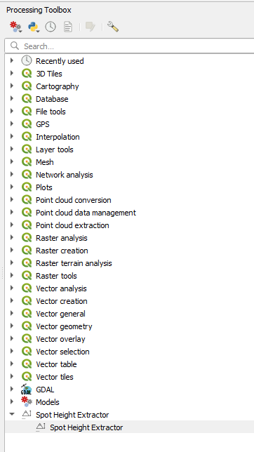
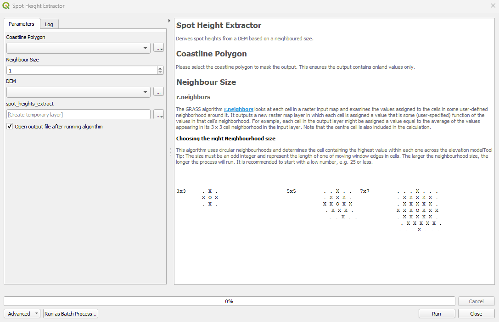

# Spot Height Extractor Plug-in

## Description
This QGIS Plug-in derives spot heights from a Digital Elevation Model.   

## Installation

Download this repo and save the folder in your plugins directory, or you can find the plugin listed in the QGIS Plugin Repository

## Usage

The tool can be found in the Processing Toolbox: 

Once the tool is activated, it opens a Processing window: 

## Coastline Polygon

Please select the coastline polygon to mask the output. This ensures the output contains inland values only.
            
## Neighbour Size

### r.neighbors

The GRASS algorithm <a href='https://grass.osgeo.org/grass83/manuals/r.neighbors.html'>r.neighbors</a> looks at each cell in a raster input map and examines the values assigned to the cells in some user-defined ""neighborhood"" around it. It outputs a new raster map layer in which each cell is assigned a value that is some (user-specified) function of the values in that cell's neighborhood. For example, each cell in the output layer might be assigned a value equal to the average of the values appearing in its 3 x 3 cell ""neighborhood"" in the input layer. Note that the centre cell is also included in the calculation.

#### Choosing the right Neighbourhood size

This algorithm uses circular neighbourhoods and determines the cell containing the highest value within each one across the elevation model

<b>Tool Tip:</b> The size must be an odd integer and represent the length of one of moving window edges in cells. The larger the neighbourhood size, the longer the process will run. It is recommended to start with a low number, e.g. 25 or less.

  

<pre>
3x3         . X .		5x5	. . X . .	7x7	. . . X . . .
            X O X			. X X X .		. X X X X X .
            . X .			X X O X X		. X X X X X .
                                        . X X X .		X X X O X X X
                                        . . X . .		. X X X X X .
                                                                . X X X X X .
                                                                . . . X . . .
  
9x9     . . . . X . . . .	   	11x11   . . . . . X . . . . .
        . . X X X X X . .		    	. . X X X X X X X . .
        . X X X X X X X .                       . X X X X X X X X X .
        . X X X X X X X .			. X X X X X X X X X .
        X X X X O X X X X			. X X X X X X X X X .
        . X X X X X X X .		    	X X X X X O X X X X X
        . X X X X X X X .		    	. X X X X X X X X X .
        . . X X X X X . .		    	. X X X X X X X X X .
        . . . . X . . . .                       . X X X X X X X X X .
                                                . . X X X X X X X . .
                                                . . . . . X . . . . .
</pre>

## Authors and acknowledgment

Original method developed in ArcGIS Pro by Bonnie Pickard.  It was subsquently adapted and updated by Elena Field for QGIS and Plug-in development.   

## License

### MIT License

Copyright (c) 2024 UK Research and Innovation (UKRI), British Antarctic Survey.

Permission is hereby granted, free of charge, to any person obtaining a copy
of this software and associated documentation files (the "Software"), to deal
in the Software without restriction, including without limitation the rights
to use, copy, modify, merge, publish, distribute, sublicense, and/or sell
copies of the Software, and to permit persons to whom the Software is
furnished to do so, subject to the following conditions:

The above copyright notice and this permission notice shall be included in all
copies or substantial portions of the Software.

THE SOFTWARE IS PROVIDED "AS IS", WITHOUT WARRANTY OF ANY KIND, EXPRESS OR
IMPLIED, INCLUDING BUT NOT LIMITED TO THE WARRANTIES OF MERCHANTABILITY,
FITNESS FOR A PARTICULAR PURPOSE AND NONINFRINGEMENT. IN NO EVENT SHALL THE
AUTHORS OR COPYRIGHT HOLDERS BE LIABLE FOR ANY CLAIM, DAMAGES OR OTHER
LIABILITY, WHETHER IN AN ACTION OF CONTRACT, TORT OR OTHERWISE, ARISING FROM,
OUT OF OR IN CONNECTION WITH THE SOFTWARE OR THE USE OR OTHER DEALINGS IN THE
SOFTWARE.
